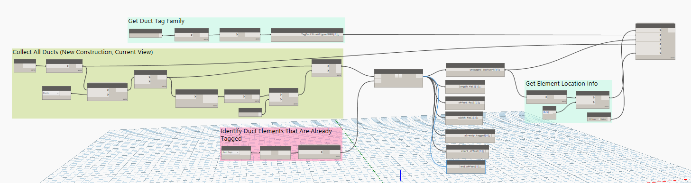
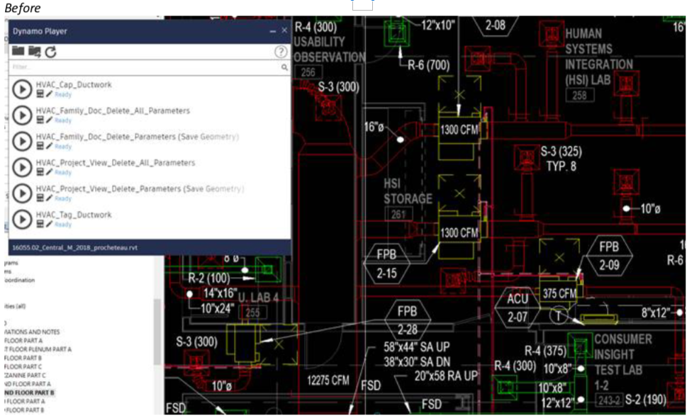

# Dynamo-Tag_Ductwork

By applying Dynamo and Python scripts, I was able to automate the tagging of in a 3D Autodesk Revit building model.
Revit already has a tool for tagging all the ductwork elements in a view, but it tags all duct elements (elbows, risers, very short branches, ductwork that has already been tagged). This ends up being a mess on plans and is counterproductive.

The Tag_Ductwork script utilizes the Revit API to locate all untagged ductwork in a model and applies a tag where
appropriate.

 

*Untagged and sufficiently large ductwork elements are identified and tagged*

